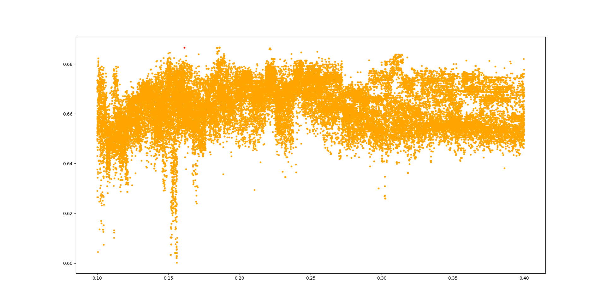
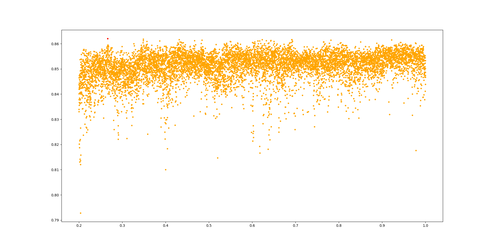

## Maxima (outdated)
Stand: 17.02.2023

| test-case | B | Gewichtung |
|-----------|---|------------|
| forest01 | 0.680514 | 0.55779666... |
| forest02 | 0.690024 | 0.14485333... |
| forest03 | 0.684019 | 0.161361 |
| forest04 | 0.824503 | 0.4003 |
| forest05 | " | " |
| forest06 | 0.836439 | 0.48858333... |
| forest07 | " | " |
| forest08 | 0.893349 | 0.66625 |
| forest09 | 0.862028 | 0.26648 |
| forest10 | 0.904838 | 0.304 |
| test_01 | 0.890562 | 0.61666... |

## Plots
Forest01: \
 \
Forest02: \
 \
Forest03: \
 \
Forest04: \
 \
Forest06: \
 \
Forest08: \
 \
Forest09: \
 \
Forest10: \
 \
Test_01: \
